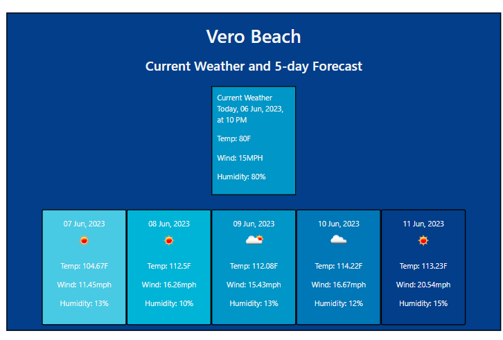

# WeatherDashboard

## Description

The Weather Dashboard can be accessed at the following URL: https://hannahmidd.github.io/CodingQuiz/

This weather application will allow users to view the current weather in their desired location, along with the 5 day forecast for temperature, wind and humidity. 

## Installation

N/A

## Usage

Under "Search for a City:", simply type in your city name and hit "Show me the weather!" to see your current, as well as 5 day weather displayed. You will be able to access the following data points: temperature, wind and humidity. 

May sunshine be in your forecast! 

## Credits

N/A

## License

Please refer to the LICENSE in the repo.